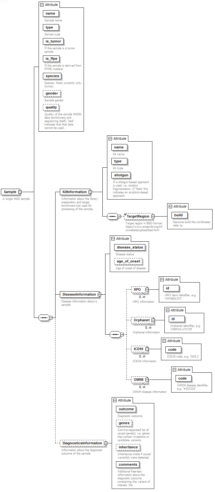

# Schema for *single sample* data exchange

The **XML schema** can be found in the repository root folder: [single_sample.xsd](../single_sample.xsd)

An example **XML file** can be found [here](single_sample_example.xml).

This graph shows the elements and attributes:

- 

